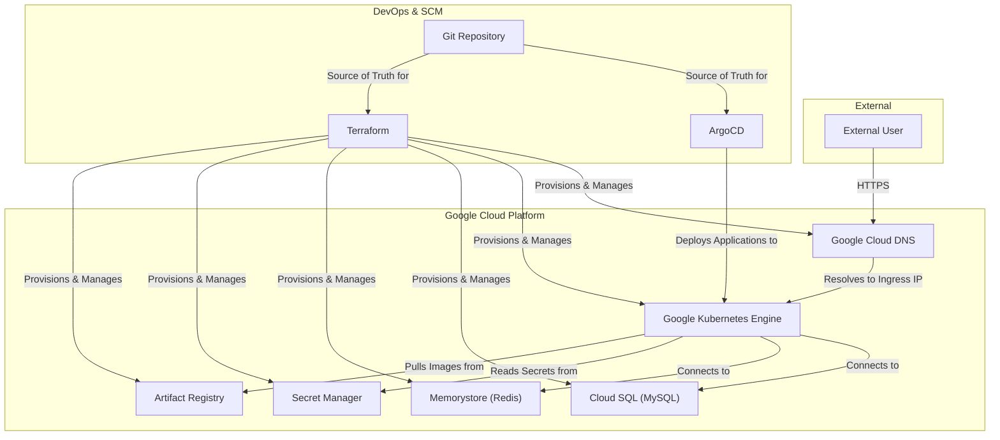
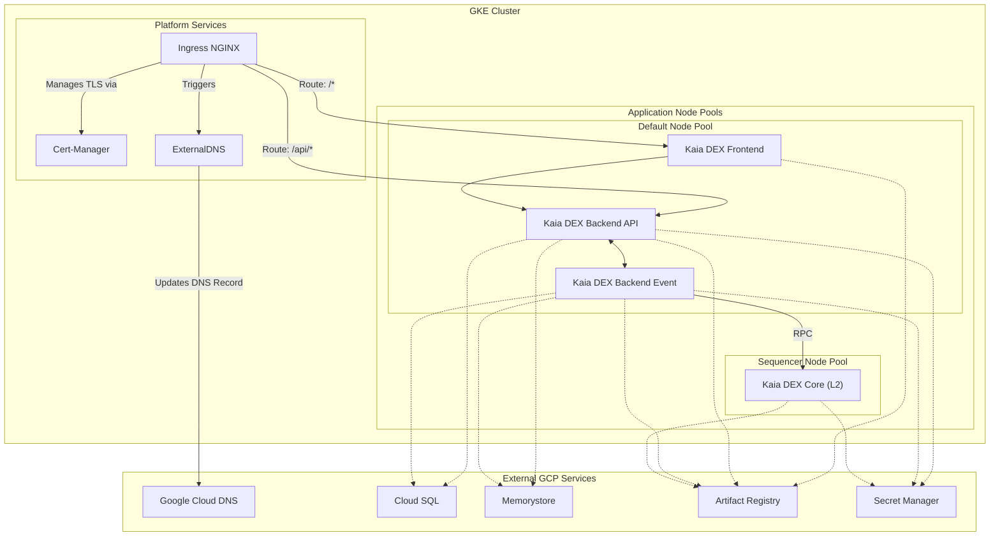
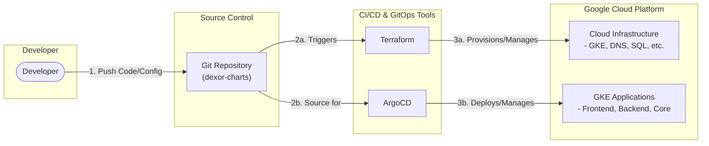

# Kaia Orderbook DEX System Architecture

이 문서는 Kaia Orderbook DEX의 전체 시스템 아키텍처를 여러 관점에서 설명합니다.

## 1. Architecture Diagrams

### 1.1. High-Level Overview

이 다이어그램은 전체 시스템의 주요 구성 요소와 그 관계를 최상위 수준에서 보여줍니다.

### 1.2. GKE In-Cluster Architecture

이 다이어그램은 GKE 클러스터 내부의 상세한 구조와 서비스 간의 상호작용을 보여줍니다.

### 1.3. Infrastructure & DevOps Flow

이 다이어그램은 개발자가 코드를 변경했을 때 인프라와 애플리케이션이 어떻게 배포되는지 그 흐름을 보여줍니다.

## 2. Component Descriptions

### 2.1. Application Components

*   **Kaia Orderbook DEX Frontend**: 사용자가 직접 상호작용하는 UI를 제공하는 웹 애플리케이션.
*   **Kaia Orderbook DEX Backend**: 시스템의 핵심 비즈니스 로직을 처리하며, `API`와 `Event` 두 개의 컴포넌트로 분리.
*   **Kaia Orderbook DEX Core**: L2 블록체인 노드. 트랜잭션 실행(Nitro)과 블록 검증(Validator)을 담당.

### 2.2. In-Cluster Platform Services (GKE)

*   **Ingress Controller (NGINX)**: GKE 클러스터 외부의 HTTP/S 트래픽을 내부의 적절한 서비스로 라우팅하는 게이트웨이.
*   **Cert-Manager**: Let's Encrypt로부터 TLS 인증서를 자동으로 발급/갱신하여 HTTPS를 자동화.
*   **ExternalDNS**: Ingress 리소스의 호스트 이름을 감지하여 **Google Cloud DNS**에 레코드를 자동으로 생성/업데이트.

### 2.3. Cloud Infrastructure & DevOps

*   **GKE (Google Kubernetes Engine)**: 전체 애플리케이션이 배포되고 운영되는 관리형 Kubernetes 환경.
    *   **Node Pool Configuration**:
        *   **Default Node Pool**: Frontend, Backend 등 일반적인 애플리케이션 워크로드를 실행하는 범용 노드 풀입니다.
        *   **Sequencer Node Pool**: `n2-standard-4`와 같이 더 높은 사양의 머신으로 구성된 전용 노드 풀입니다. `Taint`와 `Toleration`을 사용하여 Kaia DEX Core(시퀀서)와 같은 특정 워크로드만 이곳에 스케줄링되도록 격리하여 안정적인 성능을 보장합니다.

*   **Google Cloud DNS**: 도메인 이름을 Ingress Controller의 외부 IP 주소로 변환해주는 신뢰성 높은 DNS 서비스.
*   **Google Cloud SQL**: 관리형 MySQL 데이터베이스. 애플리케이션의 상태(주문, 사용자 정보 등)를 저장.
*   **Google Memorystore for Redis**: 관리형 Redis 서비스. 캐싱, 세션 관리, 실시간 데이터 처리용 메시지 큐 등으로 사용.
*   **Google Secret Manager**: API 키, 데이터베이스 비밀번호 등 민감한 정보를 안전하게 저장하고 관리.
*   **Google Artifact Registry**: 빌드된 Docker 이미지를 저장하는 프라이빗 컨테이너 레지스트리.
*   **Git Repository (`dexor-charts`)**: 모든 배포 관련 설정이 저장된 중앙 저장소 (Source of Truth).
*   **ArgoCD**: GitOps를 구현하는 도구. Git 저장소의 변경사항을 GKE 클러스터에 자동으로 배포.
*   **Terraform**: GKE 클러스터, 노드 풀, Cloud DNS, Cloud SQL 등 모든 클라우드 인프라를 코드로 관리(IaC).
